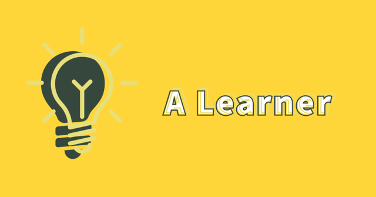

  
## Welcome to my Github Profile ! 👋

<h4>"...If you can dream it, you can achieve it. Get serious about your dream and achieve everything that you want..."</h4>

 

 

   

### 👨🏻‍💻 About Me

Hey !!! I'm a final year student studying Computer Science & Engineering. I really enjoy learning new things, especially when it's about technology.
I like working with people who are better than me because it helps me improve. 
I'm really into Java programming and solving coding problems.
I also enjoy helping out my fellow students and joining community projects.

Apart from this , I enjoy reading novels books and solving puzzles.
It helps me relax and have fun using my brain in different ways.

- 🔭 I’m currently working on : 
  
- 🌱 I’m currently learning JAVA FRAMEWORK .

- 📫 How to reach me: purvathnere@gmail.com

- ⚡ Reminder : The only way to do great work is to love what you do .
  

#### Languages and Tools:

                       

### What I Know 💻

### Competitive Programming
- C++❤️
- DSA
- Java
- Started with Python

 ### Frontend Development
  - HTML, CSS, and JS ✅
  - Bootstrap

